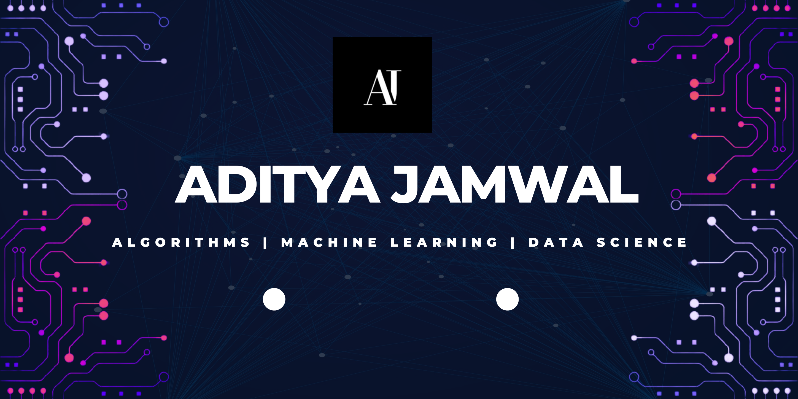
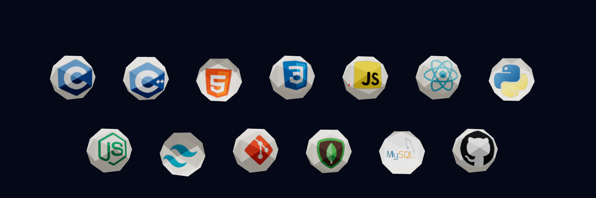

# Hi, I'm Aditya Jamwal 👋

## 🚀 About Me
- 🔭 Currently working on **Software Development and Data Engineering**
- 🌱 Polishing skills on *MERN Stack*
- 👯 Looking to collaborate on **Full Stack Development, Data Science and Machine Learning Algorithms**
- 💬 Ask me about **Data structures and Algorithms, Software Engineering**
- 📫 How to reach me: aditya.vicky01@gmail.com
 

<h3 align="left">Connect with me:</h3>

 
<h2 align="left">Tech Stack:</h2>

<h3 align="left">Also Explored:</h3>

       <a href="https://www.w3.org/html/" target="_blank" rel="noreferrer">

# Github Stats

